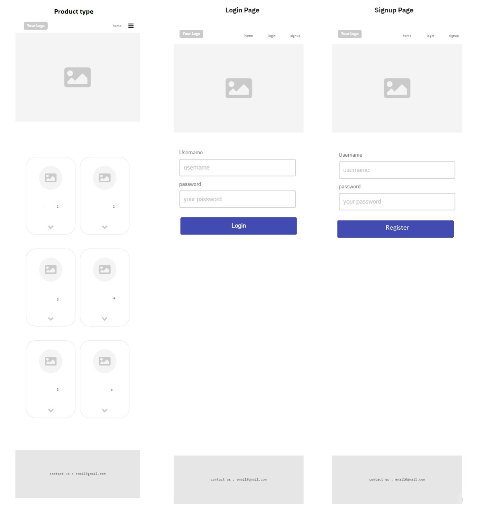
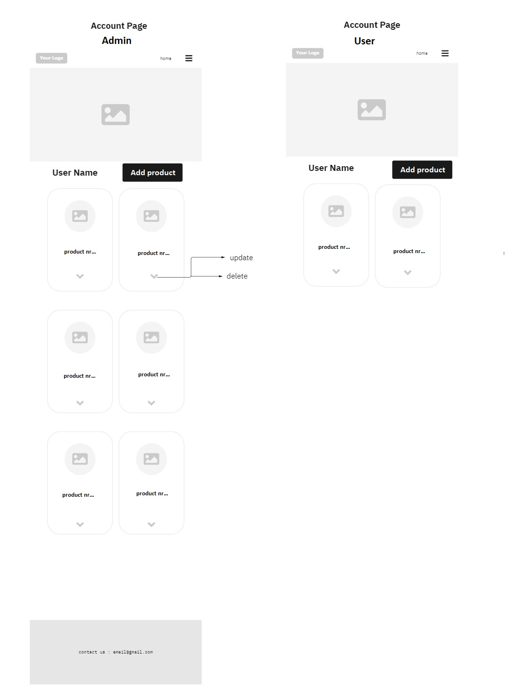
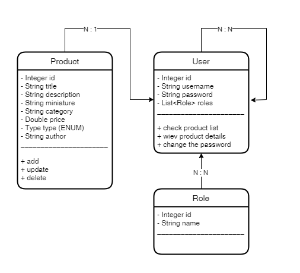

# Plant shop
---------------------------------------------------------------------------------------------------------------------------------------
## We’ve made it easy for you to bring your home to life with plants and pots.

## Tech Stack

**Client:** IntelliJ, VSCode, MySQLWorkbench

**Server:** Tomcat

## **Wireframe:**

---------------------------------------------------------------------------------------------------------------------------------------

# **User Stories**
## **Story #1**
----------------------------------------------------------------------------------------------------------------------------------------
#### **User can check product list.**
#### **User can view product details.**
#### **User can change the password.**

# **Admin Stories**
## **Story #1**
#### **Admin can check product list.**
#### **Admin can view product details.**

## **Story #2**
#### **Admin can edit the product.**
#### **Admin can save changes.**

## **Story #3**
#### **Admin can add a product and save changes.**
#### **Admin can remove the product.**

## **Story #4**
#### **Admin can check the list of users.**
#### **Admin can delete user.**
#### **Admin can add user.**

## **Story #5**
#### **User can change the password.**

----------------------------------------------------------------------------------------------------------------------------------------
## Domain Modeling + DataBase Schema Diagram

----------------------------------------------------------------------------------------------------------------------------------------

Link for the presentation:
## 🔗 Links

## Demo
https://dashboard.heroku.com/apps/plant-shop-sda

## Authors
- [@patrgor91](https://github.com/patrgor91)
- [@icharewicz](https://github.com/icharewicz)